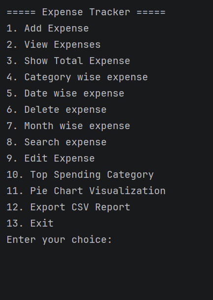
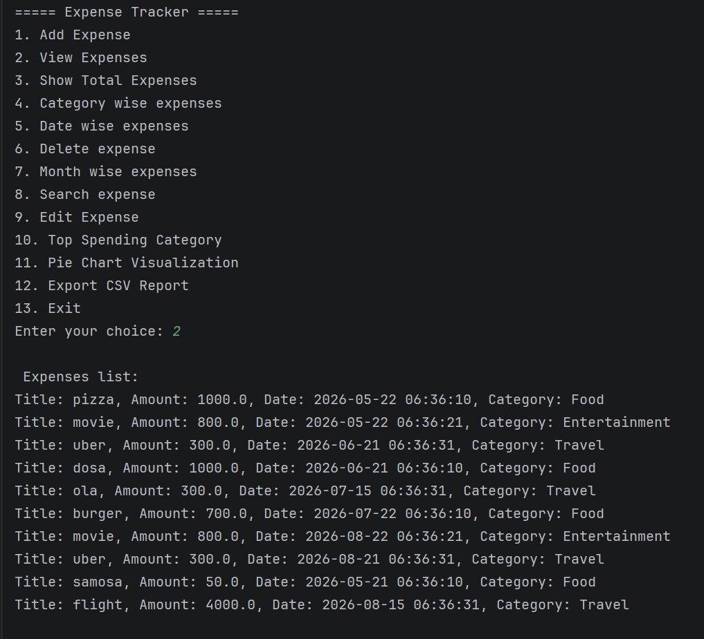
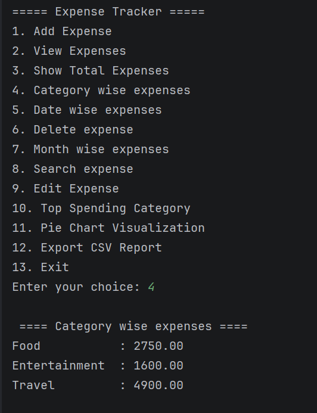
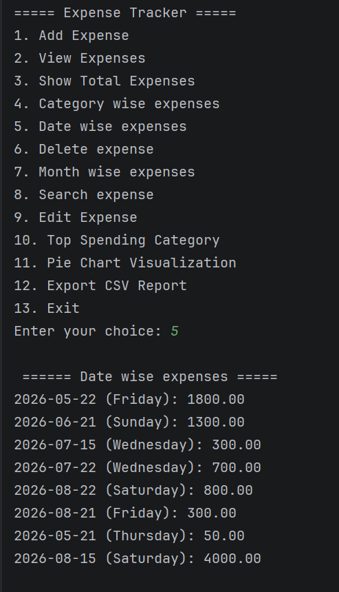
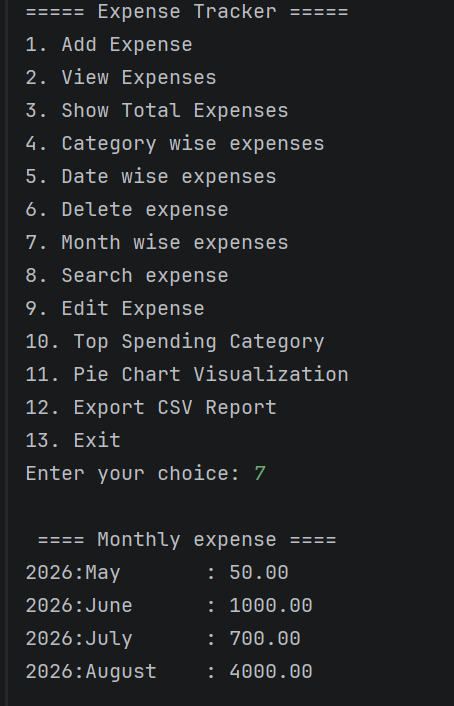
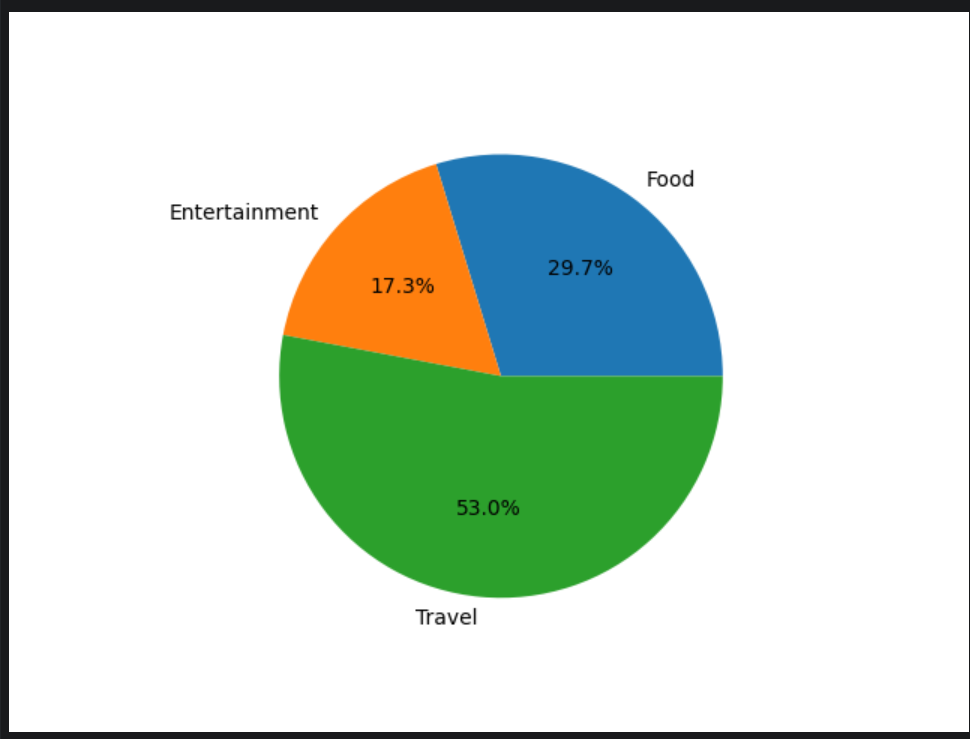

# Expense Tracker

A Python CLI-based Expense Tracker application to manage and analyze daily expenses efficiently.

This project helps users:
- Track expenses
- Categorize spending automatically
- Generate reports
- Export expense data
- Visualize spending patterns

---

# Features

- Add Expense
- View Expenses
- Edit Expense
- Delete Expense
- Search Expense
- Auto Expense Categorization
- Category-wise Expense Report
- Date-wise Expense Report
- Monthly Expense Report
- Top Spending Category
- CSV Export
- Pie Chart Visualization

---

# Technologies Used

- Python
- JSON
- CSV
- Matplotlib
- Object-Oriented Programming (OOP)

---

# Project Structure

```text
Expense-Tracker/
│
├── main.py
├── expense.py
├── expense_manager.py
├── data.json
├── requirements.txt
└── README.md

# How to Run

## Clone Repository

```bash
git clone https://github.com/yourusername/Expense-Tracker.git
```

## Navigate to Project Folder

```bash
cd Expense-Tracker
```

## Install Dependencies

```bash
pip install -r requirements.txt
```

## Run Application

```bash
python main.py
```

# Screenshots

## Main Menu



---

## View All Expenses



---

## Category-wise Report



---

## Date-wise Report



---

## Monthly Report



---

## Pie Chart Visualization


